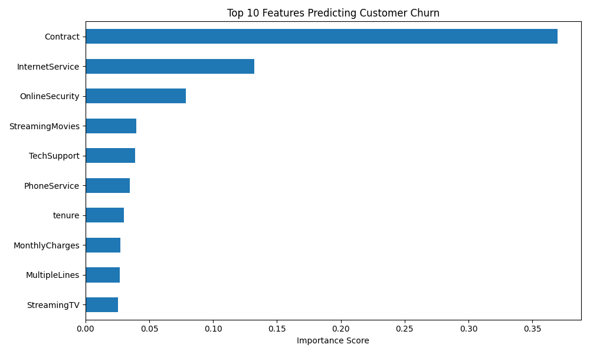

# Telecom Customer Churn Prediction using XGBoost

It is An end-to-end machine learning pipeline built to identify high-risk telecom customers. This project optimizes an XGBoost classifier for high recall to help businesses implement proactive retention strategies.

# Performance Metrics
* *Model:* XGBoost Classifier
* *Churner Recall:* 68% 
* *Primary Metric Focus:* Recall was prioritized over precision to ensure we catch the maximum number of actual churners, minimizing lost revenue.

# Feature Importance
This are the top metrics driving the model's predictive power.

# Tech Stack & Environment
* *Language:*Python
* *Libraries:* Pandas, NumPy, Scikit-Learn, XGBoost, Matplotlib
* *Environment:* VS Code on macOS